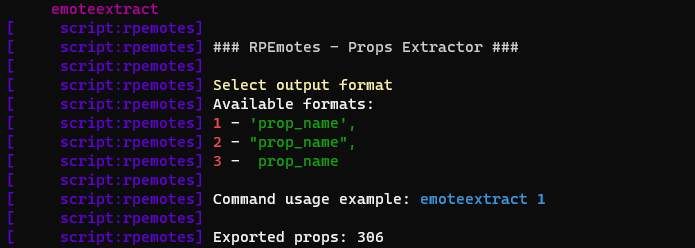
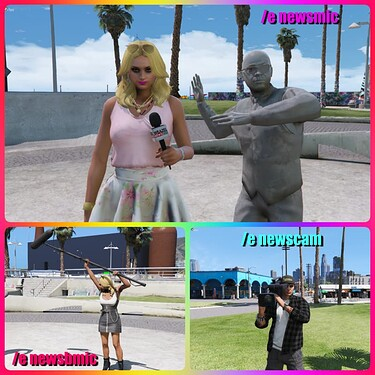
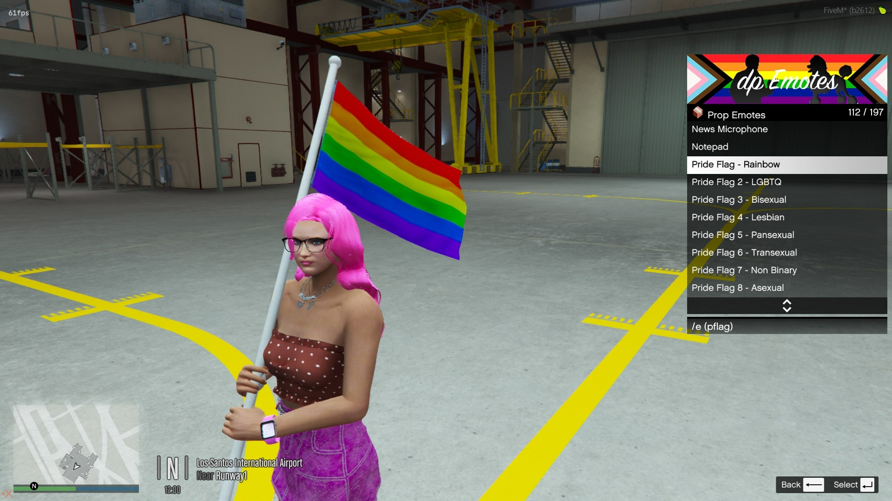
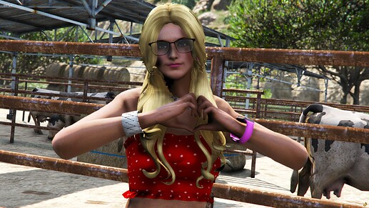
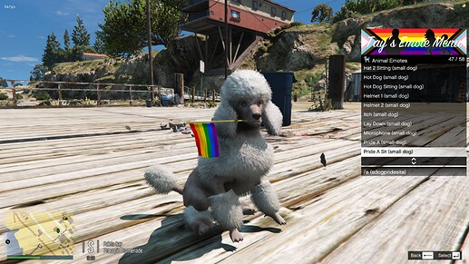
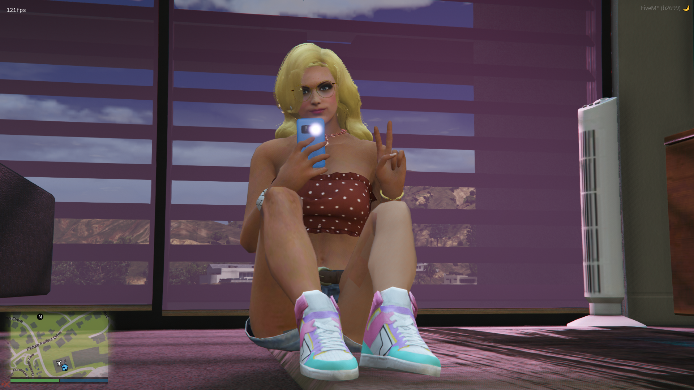
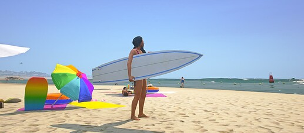
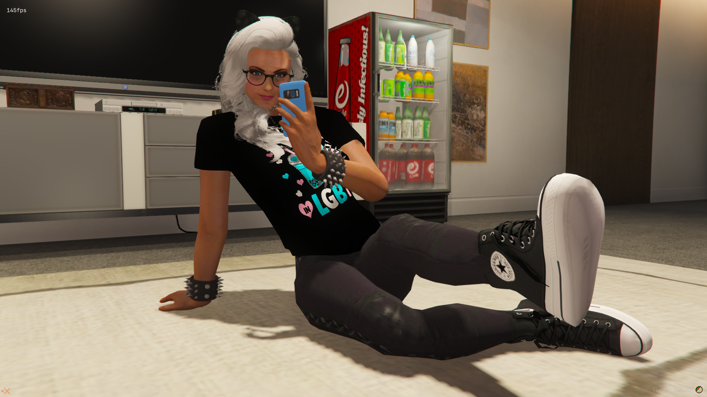
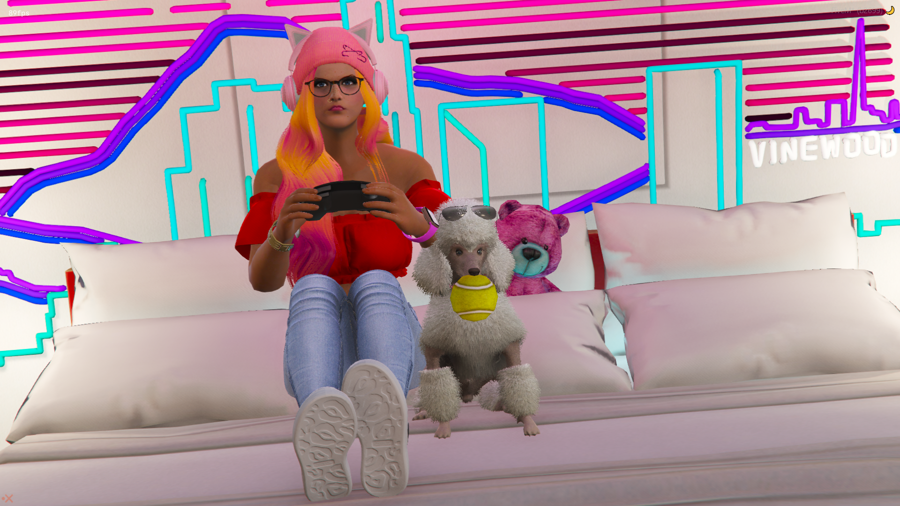
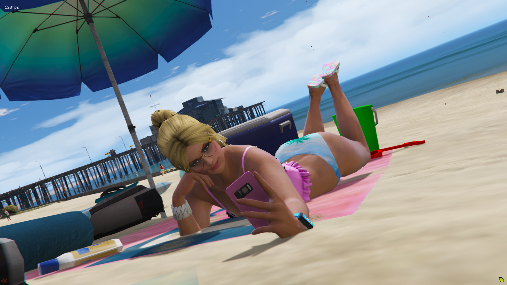

# rpemotes
Our custom emotes menu specified to the server's needs
- [Original RPEmotes](https://github.com/TayMcKenzieNZ/rpemotes)
  
---

## Features 

- Search Function 

- Custom Animations 
  
- Animal Emotes 

- Shared Dances 

- Crouching
  
- Crawling 

- Finger Pointing 

- Ragdoll 

- Hands up 

- Shared Particle Effects 

- Persistent Walkstyles and Facial Expressions via client KVP
  
- Persistent Disabling Of Idle Camera via KVP 

- SQL Keybinding Support 

- Easily convert Menyoo to RPEmotes 

- Exit Emotes 

- Binoculars

- News Camera

- Props Extractor for anti-cheat scripts
  
---

## Exports

```lua
exports["rpemotes"]:EmoteCommandStart(emoteName, textureVariation)
exports["rpemotes"]:SharedEmoteCommandStart(target, emoteName, forced) -- NEW
exports["rpemotes"]:EmoteCancel(forceCancel) – forceCancel is optional
exports["rpemotes"]:CanCancelEmote(state)
exports["rpemotes"]:IsPlayerCrouched()
exports["rpemotes"]:IsPlayerProne()
exports["rpemotes"]:IsPlayerCrawling()
exports["rpemotes"]:IsPlayerPointing()
exports["rpemotes"]:IsPlayerInAnim()
exports["rpemotes"]:toggleWalkstyle(bool, message)
exports["rpemotes"]:toggleBinoculars()
exports["rpemotes"]:toggleNewscam()
-- bool to allow the user to change their walkstyle in the menu or not / message to show the user (optional, default is :"You are unable to change your walking style right now.")"
```

---

## Menu Keybind 

The keybind uses RegisterKeyMapping. By default the configured keybind in the *initial* config.lua will be the default key, however once the keybind is set for a user it'll remain and can be changed in the users settings under `Esc > settings > keybinds > fivem`.

### Menu key:

|COMMAND: | ACTION:|
|---|---|
| F3 | Open / Close  RPEmotes menu |

Server owners can change this in the `config.lua`.

Alternatively, the player base can set their own menu keybind to open RpEmotes

`Esc > settings > keybinds > fivem`

* More keybinds are now using key mappings which means that they are now available in your FiveM settings to change (`FavKeybind` and `RagdollKeybind`)
  
---

## Keybinds and SQL 

To use the SQL features, install the latest version of the [oxmysql](https://github.com/overextended/oxmysql) resource and enable the setting in `config.lua`

```lua
SqlKeybinding = false,
```

If you do not want to use the SQL features keep the `oxmysql` region in fxmanifest.lua commented out.

Alternatively, you can use the keybind command that comes with FiveM without having to use SQL, by entering the following into F8:

`bind keyboard "Yourbutton" "e youremote"`. To remove the keybind, `type "unbind keyboard "Yourbutton"`.

---

## Increments 

Pressing 'LEFT ALT' on the keyboard allows players to scroll through the menu one by one, or by 10.

Alternatively, players can use the `SHARE` button on an Xbox controller or `OPTIONS` button on a Playstation controller.

---

## Ragdoll 

* To enable ragdoll, change `RagdollEnabled = false,` to true in config.lua.

Much like the menu key, `RagdollKeybind` is also using RegisterKeyMapping. It is currently set to `U` by default *(server side)* however can be set to the player's preferred keybind in the FiveM keybinds setting found in the settings menu within the Esc Menu.

* New setting: `RagdollAsToggle`, this will make either the ragdoll be a toggle or a hold key
  
---

# Finger Pointing & Hands Up 

Once enabled, players can press `B` on the keyboard to enable standalone finger pointing, and `Y` to put their hands up, without the need for unnecessary frameworks or "small resources".

Much like everything else in the menu, server owners can change these keybinds to their own preferences.

|COMMAND: | ACTION:|
|---|---|
| B | Toggle Finger Pointing |
| Y | Toggle Hands Up |
| /pointing | Toggle Finger Pointing |
| /handsup | Toggle Hands Up |

---

## Crouching & Crawling

### Crawling:

Server owners can opt in to either overriding the stealth/action animation when pressing the LEFT CONTROL keybind or have players tap LEFT CONTROL twice to switch from stealth to crouch (when enabled in the config.lua file)

### Crouching:

RIGHT CONTROL. Players can move forward, back, left and right as well as turning around. Press SPACEBAR to switch from stomach to back. Pressing RIGHT CONTROL key while running will have the player "dive into" a crouching animation.

### Chat Commands

|COMMAND: | ACTION:|
|---|---|
| LEFT CONTROL | Toggle Crouching On / Off |
| RIGHT CONTROL | Toggle Crawling On / Off |
| /crouch | Toggle Crouching On / Off |
| /crawl| Toggle Crawling On / Off |

---

## Moods & Walkstyles 

Moods and walkstyles can be set from the menu. These will save to your character and reapply when exiting a vehicle, or loading back into the server as they are saved via client side KVP.

|COMMAND: | ACTION:|
|---|---|
| F4 | Opens RPEmotes menu |
| /walks | See A List Of Walkstyles In Chat |
| /moods | See A List Of Walkstyles In Chat |

---

## No Idle Cam 

No Idle Cam allows players to disable the idle camera animation on foot and in vehicle, making RP scenarios, streaming on Twitch, or just general gameplay just a little more enjoyable.

|COMMAND: | ACTION:|
|---|---|
| /Idlecamon | deactivates the native|
| /idlecamoff | enables the native|

---

## Binoculars 

|COMMAND: | ACTION:|
|---|---|
| /binoculars | starts the binoculars|
| L ALT | Toggle between night, heat and normal visions |
| G | Show or hide the instructions |
| BACKSPACE | Exit the binoculars |

 

---

## News Camera 

|COMMAND: | ACTION:|
|---|---|
| /newscam | starts the News Camera |
| H |  Edit Text |
| L ALT | Toggle between vision modes |
| G | Show or hide the instructions |
| BACKSPACE | Exit News Camera |

 

---

## Favorite Emote

Players can search for an emote (so long as search is enabled) and press LEFT SHIFT and CAPLOCKS on their keyboard to add it to their 'Favorites'. Pressing CAPLOCKS will toggle the emote.

Alternatively, you can use the Favorite menu to find an emote and press enter.

---

## Exit Emotes

Exit Emotes are used to make cancelling an animation more smoother and dynamic, such as getting up off a chair or throwing a cigarette out instead of dropping it.

You can add your own Exit Emotes under `AnimationListCustom.lua`'s new `CustomDP.Exits = {}` array.

Below is an example of how this would look:

```lua
    },
    ["sit"] = {
        "anim@amb@business@bgen@bgen_no_work@",
        "sit_phone_phoneputdown_idle_nowork",
        "Sit",
        AnimationOptions = {
            EmoteLoop = true,
            ExitEmote = "getup",
            ExitEmoteType = "Exits"
        }
    },
```

The ExitEmote calls for the 'getup' emote, which is noted as the following:

```lua
["getup"] = {
        "get_up@sat_on_floor@to_stand",
        "getup_0",
        "Get Up",
        AnimationOptions = {
            EmoteDuration = 2000
        }
    }
}
```

---

## Prop Extractor 

Many people have expressed concerns over anticheat scripts kicking or banning their community members due to the fact RPEmotes uses props and anticheats detecting said props being spawned.

To make server owners' jobs a little easier, we have added a prop extractor command that you can enter into the server console which will automate a file inside the RPEmotes resource folder appropriately named, `.prop_list.lua`.

### Command:

`emoteextract`

```lua

Available output formats:
1 - 'prop_name',
2 - "prop_name",
3 - prop_name

Command usage example: emoteextract 1
```


---
## Screenshots

| | | |
|-|-|-|
|  |  |  |
|  |  |  |
|  |  |  |
|  |  | |
|  |  | |

---

## Installation Instructions

* Add `ensure rpemotes` to your `server.cfg`

* Download the latest recommended artifacts [for Windows](https://runtime.fivem.net/artifacts/fivem/build_server_windows/master/) or [for Linux](https://runtime.fivem.net/artifacts/fivem/build_proot_linux/master/)

* [Enforce gamebuild to latest build](https://forum.cfx.re/t/tutorial-forcing-gamebuild-to-casino-cayo-perico-or-tuners-update/4784977) for all emotes and props to work as intended.

**Onesync Infinity is required for the particle effects to work as intended** This can be done via txadmin or your localhost .bat file.**

For localhost servers, comment out onesync from your server.cfg and add the following to your `.bat` file:

```lua

+set onesync on +set onesync_enableInfinity 1 +set onesync_enableBeyond 1 +set onesync_population true

```

You can put this before your gamebuild enforcement, aka `+set sv_enforceGameBuild XXXX`

* Set the desired language and settings in the config.lua under `MenuLanguage = 'en',`

* Qb-Core server owners, set `Framework = 'qb-core'` in the config file, otherwise leave it as false.

* To use the SQL features, install the [oxmysql](https://github.com/overextended/oxmysql) resource then open `keybinds.lua` in RPEmotes. If you do not want to use the SQL features, comment out the `oxmysql` region in fxmanifest.lua.

Alternatively, you can use the keybind command that comes with FiveM without having the SQL, by entering the following into F8:

`bind keyboard "Yourbutton" "e youremote"`. To remove the keybind, type `"unbind keyboard "Yourbutton"`.

* Type `/refresh` and `/start rpemotes` into your chat resource, or simply restart your server

# Additional Instructions ⚙️

- **Check out my youtube playlist below:**

[](https://www.youtube.com/watch?v=3uVe0hvWwPQ&list=PLzFM1zdDHFn2vKWT323wVJoEkGhWiyyeC)

---

## Shared emotes 

Emotes will work with either `SyncOffset` or `Attachto`.

- If it is with `SyncOffsetFront` or `SyncOffsetSide`, then the offset used is the one of the emote the player started.<br/>
For example, if player one starts the emote `handshake` which has `SyncOffsetFront`, then player one will have the `SyncOffsetFront` but not the other player.


- If it is with `Attachto`, then it'll either be player one's data used for attaching, or the player two's data.<br/>
For example, if player one start the emote carry, then the other player will be attached but not the player one because Attachto is set in `carry2` and not `carry`.<br/>
- If player one starts the emote `carry2`, then player one will be attached and not the other player.
it's the player who start the animation who will in most cases be moved


*Special case, if both emote have the `Attachto` then only the player who started the emote will be attached.*

You can find a list of ped bones to attach the other player here: [Ped Bones](https://wiki.rage.mp/index.php?title=Bones) or alternatively if the link is down for some reason, you can check [here](https://wiki.rage.mp/index.php?title=Bones)

Using the websites provided above, enter the bone ID, ie `1356` and not `111`, which is the Bone Index.

Understandably, this can be confusing for some people. We suggest using the `Attachto` approach.

---

## Particle Effects

**REQUIRES ONESYNC INFINITY**

Particle effects can be found using the [DurtyFree GTA V Dump](https://github.com/DurtyFree/gta-v-data-dumps/blob/master/particleEffectsCompact.json). You will need to add the particle assest, name, and placement. Placement is done via XYZ, Pitch, Roll, Yaw, and scale.

Onesync is required for them to work across all clients.

```lua
PtfxPlacement = {
    -0.15, -- X
    -0.35, -- Y
     0.0, -- Z
     0.0, -- ROTATION X
     90.0, -- ROTATION Y
     180.0, -- ROTATION Z
       1.0 -- SCALE
},
```


By default, the main prop will share it's coordinates with the particle effect, so just put 0.0 for the particle effects and you will be good to go.

If no prop is used in the animation or you require the particle effect to be in a different location, use `PtfxNoProp = true`, and 0.0 will 9/10 times be the human peds' stomach; you can then offset your coordinates based on that with the first 3 entries being XYZ, and the last 3 being rotation XYZ.

Alternatively, you can use the `PtfxBone =` AnimationOption to attach the PTFX to the ped's bone, simiarly to how you attach props.

Using Menyoo, spawn down a tennis ball and attach it to human, by default menyoo will attach it to the SKEL_ROOT bone (stomach), so from that, what we can do is is either offset the coordinates, say, up to the human ped's mouth, or change the bone all together. Once we've got it correct, we can transfer those coordinates over to rpemotes, and tah dah, we have our Ptfx Placement.

---

## Adding Your Own Animations 

Because the menu gets updated frequently, the files get overwritten. To avoid this, you can add your own / downloaded animation files `(.ycd)` inside of a newly created folder, give it a name, and place it in the `rpemotes\stream\[Custom Emotes]` folder.

Add your animation code to the `AnimationListCustom.lua` and make a backup of this file, call it `BackUpAnimationListCustom.lua`.

Whenever an update is released, rename `BackUpAnimationListCustom.lua` to `AnimationListCustom.lua`, click yes to overwrite, and you're good to go.

It is also a good idea to keep a backup of your config file.
Below is an example:


